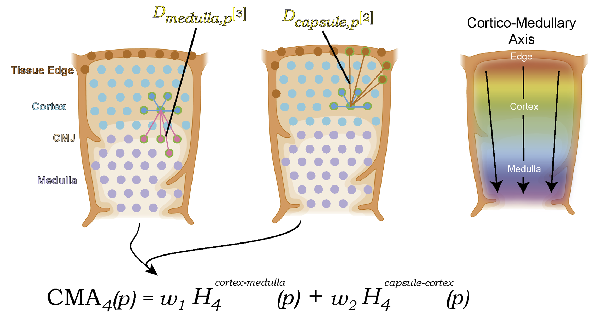

Full model assembly and binning
======

Now that we have set our base function that defines the position between 2 structures and assigned a relative score, we can concatenate two of these functions in order to account for multiple structures. 
In addition since the position functions are directional we can decide how one would affect the other. These question should be derived based on the specific biological question. 
In our case, we wanted to derive a CCF for the human thymus, thus we constructed our axis to model the position from the outer capsule of the cortex -> to the cortex -> to the cortico-medullary junction - > and finally to the depth of the medulla. 

For this we have derived the following formula: 

* note, for visualisation reasons the grid here is much more course than we derived (see next section for actual data) and for the same reasons number of KNNs is 4 

 

