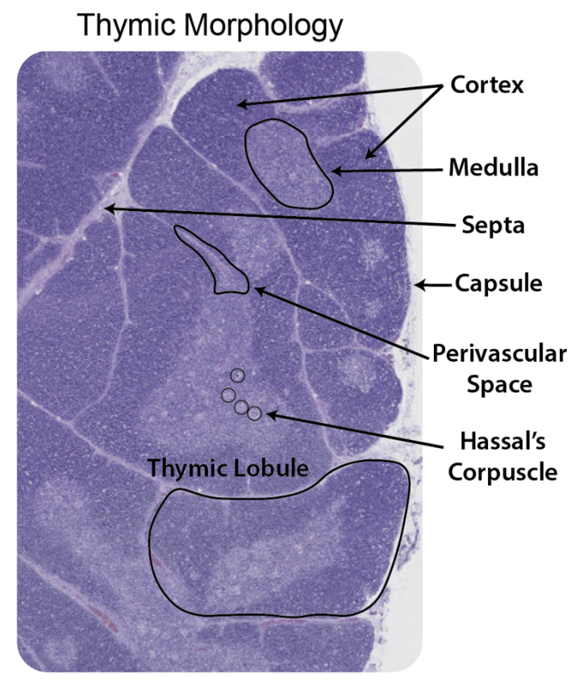

Thymus morphology and T cell maturation
-----------------
The thymus gland is a multilobular organ responsible for thymocyte (T cell) maturation. T cells mature through migration within the compartments of the thymus; initially, precursor cells migrate from the peri vascular space (PVS) to the Cortex where TCR rearrangement and positive selection (the ability to bind MHC Class I/II molecules) occurs.  Cells then migrate to the medulla to undergo negative selection (for interaction with self peptides) and where cells eventually leave the thymus to become Naive T cells. 
Interestingly, there are no biological membranes that divide these two macro morphological compartments and cells are free to roam space during their journey. However, as opposed to the mouse brain, the thymus is highly plastic and can even change even over the course of days, for example, in response to infection.

|pic1| |pic2|

.. |pic1| image:: images/illustration_T.PNG
   :width: 45%
image credit: BioRender

Motivation to construct the Cortico-Medullary axis
---------------
We aimed to construct a thymus CCF model to capture the essential morphological axis within the thymus—from the cortex edge (capsule) to the deepest part of the medulla. This model aims to reveal migration patterns and identify the 'cytokine highways' within the thymus in higher spatial resolution than discrete annotations permit. 
To address the highly variable features of the human thymus, our OrganAxis approach considers both local and global influences within and between discrete structures. By deriving a score (or position) from a non-linear transformation of Euclidean distance, we can adjust the extent to which the score is influenced by its proximity to a specific structure. Essentially, we attempt to capture the cell's environment and map that environmental characteristic onto a one-dimensional axis.

.. image:: images/cell_blind.PNG
   :width: 50%
image credit: DALL-E

Full model assembly and binning
======

Now that we have set our base function H that defines the relative position between 2 structures and assigned a relative score, we can concatenate two of these functions in order to account for multiple structures. 
In addition, since the position functions are directional we can decide how one would affect the other. These questions should be derived based on the specific biological question. 
In our case, we wanted to derive a CCF for the human thymus, thus we constructed our axis from the outer capsule of the cortex -> to the cortex -> to the cortico-medullary junction - > and finally to the depth of the medulla. 

For this we have derived the following formula where w1 and w2 factor in the influence of each component on the general score for point p.

To act as a true CCF, we must develop a common jargon between the scientific community. And since it's not very intuitive or informative to address "thymus CMA position 0.5 to 0.6", we further bin the axis by layers that refer to anatomically informed positions. 
Here, we demonstrate this concept on a simplified representation of the thymus going from the leftmost broad anatomical annotations, to the continuous axis and the right-most binned axis. 
Bottom row shows the implementation of the CMA and binned axis on IBEX since cell segmentation data (scale bar is 500 microns) of a paediatric thymus.  

.. image:: images/full_model_illustration.PNG
   :width: 100%
 

