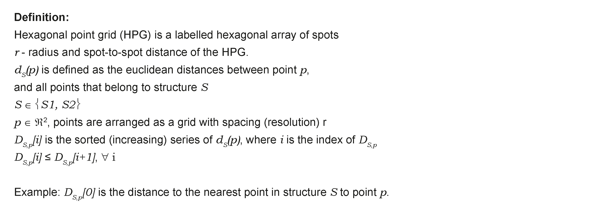

Model
=====
1. Definition of distance function (D), spatial location (P), and structure (S) 
---------------
Once our grid is set we can define our basic distance function (D) that is the minimal distances of every point P to nearest neighbours (K) in structure S. In the illustration below, we show how the minimal distance is defined to S1 which contains P and S2 which doesn't contain P. 

.. image:: images/grid_space_3.PNG
   :width: 75%

2. Mean distance of KNN points to P
-------------
From D, we can now calculate the mean distance of point P from S for a set of K nearest neighbours
For that we can simply define: 

.. image:: images//mu_equasion.png
   :width: 100%

3. Constructing the boundary-centered axis
--------------
Next, we can calculate the directional position of a point P from the boundary of two structures by the normalized difference of µKS1(p) and µKS2(p). 

.. image:: images//H_function.png
   :width: 100%

Exploration and intuition from simulations of K and grid resolution on axis function
--------------

To study the influence of K or grid density on how space is transformed to the axis position, we generated simulated data of a grid and random spots in space within that grid. For simplicity, we are evaluating the relationship between the linear position along Y and the axis function H

**Changing the K nearest neighbours and keeping the grid constant:** Noise is reduced while H is "flattened" with K. In K=30 we can start seeing edge effects where the score is diminished by lack of near grid spots.  

.. image:: images/supp_axis_params_knn_simulations-04.png
   :width: 100%

**Changing the grid spacing and keeping K constant:** At low grid density relative to K, the dependency of H is more gradual and edge effects are visible. In the highest grid density H behaves as a full sigmoid and transitions if faster around the border.  

.. image:: images/supp_axis_params_knn_simulations-01.png
   :width: 100%

**Changing both grid spacing and K in a matrix** 

.. image:: images/supp_axis_params_knn_simulations-02.png
   :width: 100%

