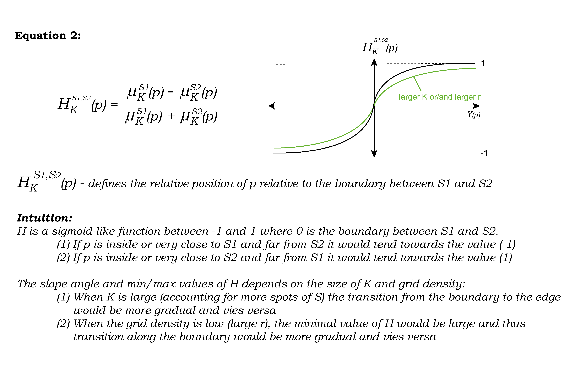

Model
=====
1. Definition of distance function (D), spatial location (P), and structure (S) 
---------------
After establishing our grid based on the sampling resolution r (the distance between spots), we can define our fundamental distance function (D). This function calculates the minimal distances from every point P to its K nearest neighbours within a structure (S). The figure below demonstrates how we determine the minimal distance to structures S1, which includes P, and S2, which does not include P.

.. image:: images/Capture_1.PNG
   :width: 100%

.. image:: images/grid_space_3.PNG
   :width: 75%

2. Mean distance of KNN points to P
-------------
With D defined, we proceed to calculate the mean distance from point P to structure S across a set of K nearest neighbours. To achieve this, we introduce μ, the mean of minimal distances, where K represents the count of nearest neighbours. 
For that we can define: 

.. image:: images//mu_equasion.png
   :width: 100%

3. Inferring the normalised relative distance to a boundary
--------------
Subsequently, we can compute the relative (directional) position of any point P with respect to the boundary dividing two structures. This is done through the normalised difference between μS1 and μS2. Function H describes a sigmoid in space, scaling between -1 and 1, with 0 marking the boundary between structures S1 and S2. 

Exploration and intuition from simulations of K and grid resolution on axis function
--------------

To study the influence of K or grid density on how space is transformed to the axis position, we generated simulated data of a grid and random spots in space within that grid. For simplicity, we are evaluating the relationship between the linear position along Y and the axis function H

**Changing the K nearest neighbours and keeping the grid constant:** Noise is reduced while H is "flattened" with K. In K=30 we can start seeing edge effects where the score is diminished by lack of near grid spots.  

.. image:: images/supp_axis_params_knn_simulations-04.png
   :width: 100%

**Changing the grid spacing and keeping K constant:** At low grid density relative to K, the dependency of H is more gradual and edge effects are visible. In the highest grid density H behaves as a full sigmoid and transitions if faster around the border.  

.. image:: images/supp_axis_params_knn_simulations-01.png
   :width: 100%

**Changing both grid spacing and K in a matrix** 

.. image:: images/supp_axis_params_knn_simulations-02.png
   :width: 100%

