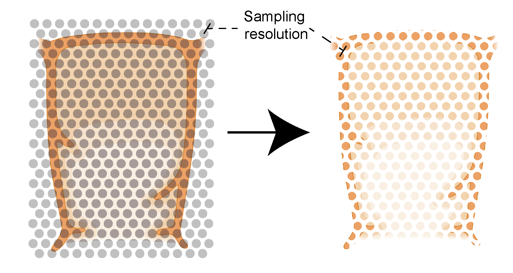

Model construction
=====
1. Consistent Tissue Annotations
------------ 
We recognized inconsistencies in the possibility of obtaining robust tissue annotations from various spatial technologies. For example, Visium (10X Genomics) is often annotated in the "10X Loupe Browser" (https://www.10xgenomics.com/support/software/loupe-browser/latest), which restricts annotations to a 100µm spot-to-spot resolution. For annotation of IBEX (https://www.nature.com/articles/s41596-021-00644-9) and other imaging-based platforms, users might use tools like the excellent Napari (https://napari.org/stable/), where annotations are done at the pixel level, although specific plugins are constantly developed for various spatial technologies. However, this can be difficult to interact with on cluster infrastructure which bioinformaticians routinely use. This incompatibility, along with the need for a simple, open-source tool to annotate tissues at a well defined resolution and within the popular Jupyter notebook environment, led us to develop **TissueTag** (https://github.com/nadavyayon/TissueTag/tree/main) and we would suggest you try it out on your spatial data!

2. Definition of the spatial sampling resolution
---------------
In addition to the above, I belive it is critical to define the spatial sampling freqwency of your CCF and keep constant across samlpes, conditions and technologies. While this might seem basic it is often idnored! Essentially, each image has its own pixel size which depends on the microscope's configuration and the experimenter's choice. In fact, the spatial sampling resolution is independent of the imaging resolution and can even be higher than the pixel resolution. Practically, we will construct an hexagoanl point grid (HPG) in space with a set resolution and which all our calculations would be based on. Like any filter, selecting a spital frequency will affect the ability to capture spatially variable patterns. Thus, the resercher should explore different options and estimate to chich degree the spatial variance is represented. 

image credit: BioRender

Distance function (D) for point (P) and structure (S) 
---------------
Once our grid is set we can define our basic distance function (D) that is the minimal distances of every point P to nearest neighbours (K) in structure S. In the illustration below, we show the how the minimal distance is defined to S1 which contains P and S2 which doesn't contain P. 

Definition:

1) Let p ∈ R^2 be any point on an HG with spacing - r

2) Let S be an assembly of p points inside an anatomical structure,S ∈ {Medulla,Cortex,Capsule….}

3) dS(p) is defined as the euclidean distances between point p, and all points that belong to structure S.

4) DS,p[i] = is the sorted (by minimal value) series of dS(p), where i is the index of DS,p.

   DS,p[i] ≤ DS,p[i+1]  ,∀ i

Example - DS,p[0] is the distance to the nearest point in structure s to point p

.. image:: images/grid_space_3.PNG
   :width: 100%
image credit: Nadav Yayon

Mean distance of KNN points to P
-------------
Aside from the spatial grid resolution, we also need to define how many KNN points to take to calculate the mean distance of point P from S. 
For that we can simply define Equation 1:  µKS(p) = (i=0 to K-1)∑(DS,p[i]/K) 

Constructing the boundary axis and the influence of K and grid resolution
--------------
Next, we can calculate the directional position of a spot from the boundary of two structures by simply subtracting µKS(p) in respect to both structures for a given spot P. 
This difference is then intrnally normalised to produce a sigmoidal-like function. 
In the simplified simulated plot below we can see the influence of KNN or grid density on how space is transformed to the axis position. 

image credit: Nadav Yayon

.. image:: images/changing_k.png
   :width: 100%
image credit: Nadav Yayon

image credit: Nadav Yayon

