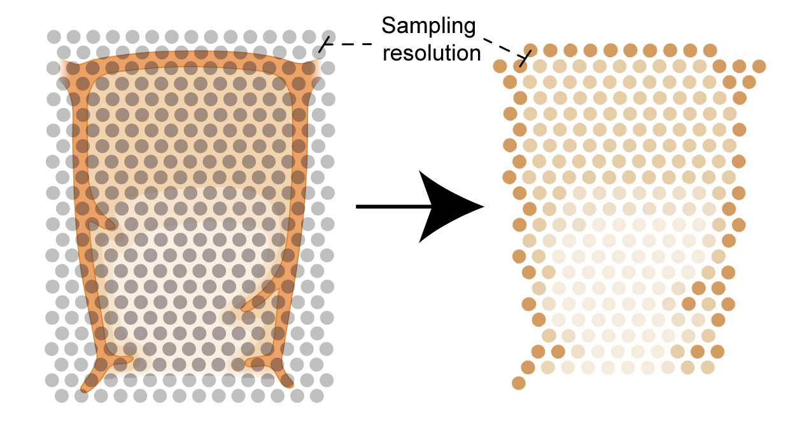

Prerequisites for the establishment of a CFF
=================

Consistent tissue annotations
------------ 
We identified a significant gap in the ability to obtain robust tissue annotations across various spatial technologies. For instance, Visium spatial transcriptomics data (10x Genomics) is commonly annotated using the 10x Genomics Loupe Browser (https://www.10xgenomics.com/support/software/loupe-browser/latest), which limits annotations to a resolution of 100 µm between individual Visium spots. For annotating imaging technologies, such as IBEX, users may turn to tools like Napari (https://napari.org/stable/), where annotations can be made at the pixel level and specific plugins for different spatial technologies are being developed continuously. Nonetheless, the use of external software presents challenges for tissue annotations on cluster infrastructure, which is a common environment for bioinformaticians. These challenges motivated us to create TissueTag for interactive tissue annotation within a Jupyter notebook environment (https://github.com/nadavyayon/TissueTag/tree/main).

Spatial sampling resolution
---------------
Each spatial method comes with its unique sampling resolution. However, to develop a CCF that enables comparison across multiple modalities, it is crucial to precisely define the spatial sampling frequency of the tissue and consistently maintain it across all samples and modalities. Spatial sampling frequency is defined in μm/ or mm (e.g. spot every 2 μm) and is independent of the imaging resolution, which is defined in pixel space. To harmonise sampling frequency across technologies one can create a hexagonal point grid (HPG) with a predetermined sampling frequency, onto which pixel level annotations are mapped. Similar to any filter, choosing a specific spatial resolution will impact the ability to discern fine structures but will enhance noise robustness. Therefore, researchers should adjust the sampling frequency to match the spatial variability that is necessary to address their research question. Opting for a lower spatial sampling size might overlook finer structures and thus reduce the level of detail, yet it can offer more robustness.

**In this (extreme) example, selecting a low spatial frequency underrepresents the high frequency structures (capsule) but does captures the broad structures (medulla and cortex).**

Image credit: partially adapted from BioRender
