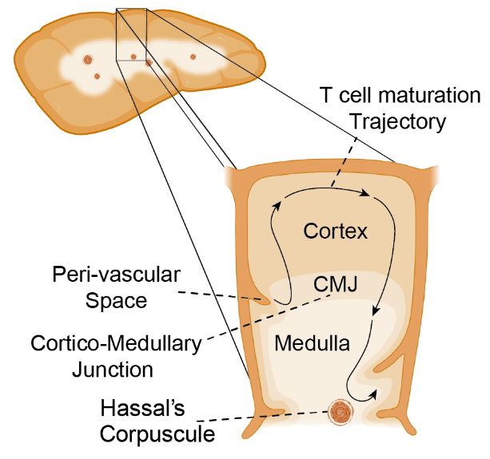
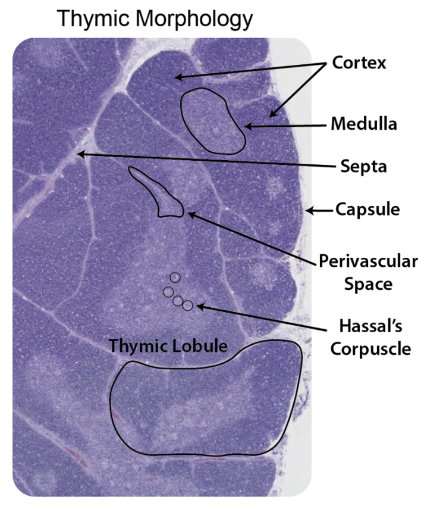
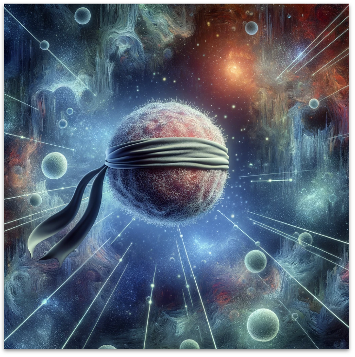

Introduction
=====

Biological tissues are classically subdivided by discrete compartmental niches predefined through careful examination by histologists. However, the distributions of cells *within* these discrete structures are determined by orchestrated signaling events during development, differentiation, or migration, following autocrine, paracrine, and endocrine signaling.

Common Coordinate Framework
-----

A Common Coordinate Framework (CCF) is broadly defined as a set of rules that allows researchers and physicians to develop a common language when discussing a morphological tissue location. One of the best examples of a successful CCF is the Allen Mouse Brain Atlas - https://mouse.brain-map.org/static/atlas. This resource, accompanied by computational tools that allow mapping of any 2D section to this CCF, allowed researchers to accumulate knowledge from multiple studies, which is essential for scientific progress.

However, apart from the mouse brain and perhaps a few 3D human scans in MRI studies, we lack CCFs for any other organ.

Thymus morphology and T cell maturation
-----------------

The thymus gland is a multilobular organ that is responsible for thymocyte or T cell maturation. T cells mature through migration within the compartments of the thymus, initially TCR rearrangement and positive selection occurs in the cortex, and cells then complete negative selection in the medulla. However, there are no biological membranes that divide these two morphological components.  
Hence, in an attempt to capture a CCF for the thymus, we aimed to model the major morphological axis of the thymus - from the edge of the cortex to the "deepest" point of the medulla and give a position along this axis to any spot in the thymus. However, as opposed to the mouse thymus and the mouse brain that are highly similar between different mice, the thymus is highly plastic and can even change even over the course of days, for example, in response to infection. In addition, it is highly repetitive.

|pic1| |pic2|

image credit: BioRender

Motivation to construct the Cortico-Medullary axis
---------------
We set out to construct a thymus CCF and attempt to capture the relative position of a cell in continuous space. To overcome the highly variable features of the human thymus, the **OrganAxis** approach aims to account for both local and global influences within and between structures. By deriving a score based on a non-linear transformation of Euclidean distance, we can control how much the cell is influenced by its proximity to a structure. In a way, we are trying to mimic what the cell is "seeing" in space and project that environmental feature to a unidimensional axis.

image credit: DALL-E
