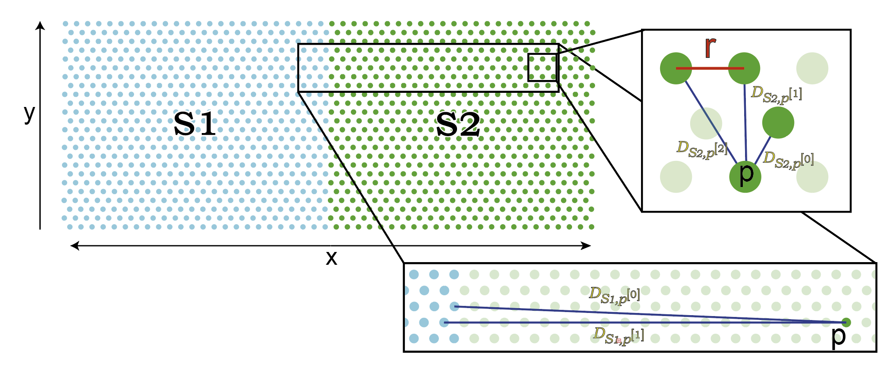

Model construction
=====

Motivation to construct the Cortico-Medullary axis 
---------------
We set to construct a thymus CCF through accounting to the relative position of a cell in continuous space. To overcome the highly variable features of the human thymus, OrganAxis approach aims to account for both local and global influences within and between structures. By deriving a "position" or a score to how much the cell is influenced by its proximity to structure.

Definition of the spatial sampling resolution
---------------
Before we can calculate the distance functions for the axis, we first need to define our spatial sampling resolution. While this might seem weird it is not a trivial task! Each image has its own pixel size which depends on the microscope's configuration and the experimenter's choice. However for the CCF calculation to be robust and consistent, we need to define the spatial sampling resolution and keep it identical throughout the study. In fact, the spatial sampling resolution is independent of the imaging resolution. Practically, we will construct an hexagonal grid (HG) in space with a set resolution and which all our calculations would be based on. It is recommended to set the HG resolution to be sufficiently high to capture the morphological variance needed. 

Definition of the spatial sampling resolution
---------------

